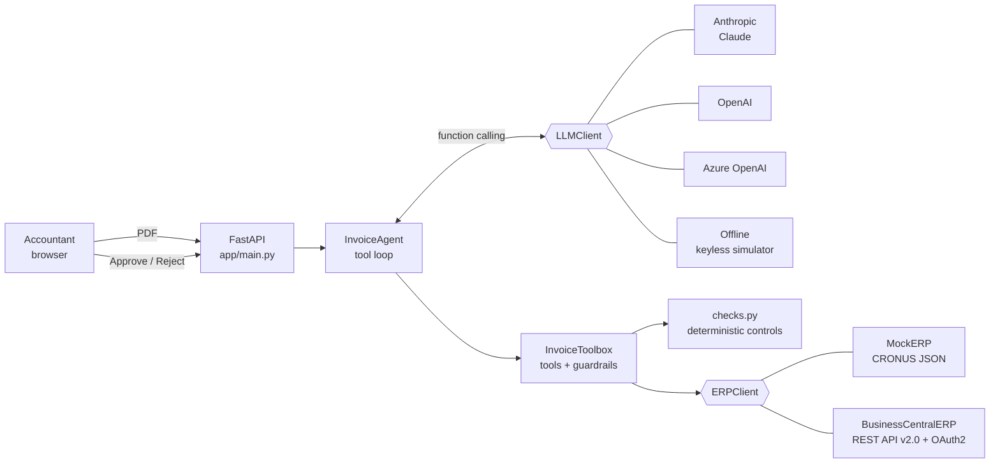

# AI Agent for Supplier Invoice Entry — Dynamics 365 Business Central

🇫🇷 [Version française](README.md)

This is a demo of an **AI agent** that reads a supplier invoice PDF, checks it against the ERP and creates a **draft purchase invoice** in Microsoft Dynamics 365 Business Central. An accountant approves or rejects it with one click. **Nothing is posted without human approval.**

> **5 minutes of data entry → 30 seconds of review.**

---

## 1. The business problem

Most SMEs and mid-sized companies still enter supplier invoices by hand:

| Manual step | Typical time |
|---|---|
| Open the PDF and find the vendor in the ERP | ~1 min |
| Find the purchase order, compare lines and prices | ~1–2 min |
| Check the invoice hasn't already been entered | ~30 s |
| Key in the purchase invoice header and lines | ~1–2 min |
| **Total** | **≈ 5 min / invoice** |

The work is repetitive and error-prone: typos, duplicates paid twice, price increases nobody notices. The agent does the work and leaves the accountant only the decision, **≈ 30 s of review**.

**Estimated gain** at 1,000 invoices/month: 1,000 × 4.5 min ≈ **75 hours/month**, about half an FTE, plus the errors it avoids (duplicates, price gaps). *This is an order of magnitude; measure it on the customer's real volume.*

## 2. What the agent does

1. You **upload** an invoice PDF in the web UI.
2. **The LLM extracts** the vendor, VAT number, invoice number, date, due date, PO reference, lines (description, quantity, unit price), net amount, VAT and gross amount.
3. The agent calls **ERP tools (function calling)** itself:
   - `search_vendor`: looks up the vendor by VAT number, then by fuzzy name match
   - `check_duplicate_invoice`: checks whether the invoice number already exists
   - `find_purchase_order` / `compare_with_purchase_order`: matches the invoice against the PO
   - `create_draft_purchase_invoice`: creates the purchase invoice **as a draft**
4. **Anomaly detection**: amount gap vs the PO, price or quantity gap, duplicate, unknown or blocked vendor, inconsistent totals (lines ≠ net, net + VAT ≠ gross), unusual VAT rate.
5. **The UI** shows the extracted data, the agent's **step-by-step reasoning** (every tool call with its arguments and response), anomalies, a PDF preview, and **Approve** (post) / **Reject** (delete the draft) buttons.

### Design principles (guardrails)

- **The LLM orchestrates; code does the checks.** Every check (arithmetic, duplicates, PO gaps) is computed by deterministic code inside the tools. The model can't invent an anomaly or hide one.
- **Guardrails live on the server, not only in the prompt.** `create_draft_purchase_invoice` refuses to create a draft if the data wasn't recorded, the vendor is unknown or blocked, or the duplicate check wasn't run or found a duplicate.
- **The recommendation is capped.** If blocking anomalies exist, the system downgrades an LLM "validate" recommendation to "review".
- **A human decides.** The agent never posts. Only the *Approve* button calls the Business Central `post` action.

## 3. Architecture



| Layer | Files |
|---|---|
| API & UI | `app/main.py`, `app/static/` (plain HTML/CSS/JS, no build step) |
| Agent | `app/agent/invoice_agent.py` (system prompt, orchestration), `tools.py` (tool schemas, execution, guardrails), `checks.py` (business controls) |
| LLM abstraction | `app/llm/base.py` + `anthropic_client.py`, `openai_client.py` (OpenAI & Azure OpenAI), `offline_client.py` |
| ERP abstraction | `app/erp/base.py` + `mock_erp.py`, `business_central.py` |
| Data & samples | `data/seed/`, `samples/`, `scripts/generate_invoices.py` |

## 4. Getting started

You need Python 3.11 or later.

```bash
pip install -r requirements.txt
cp .env.example .env                  # Windows: copy .env.example .env
python scripts/generate_invoices.py   # (re)generates the test PDFs in samples/
uvicorn app.main:app --reload
```

Open http://127.0.0.1:8000, then click a demo invoice or drop a PDF.

### LLM provider (`LLM_PROVIDER`)

| Value | Use | Variables |
|---|---|---|
| `offline` *(default)* | Runs **with no key and no network**: rule-based extraction and a scripted tool sequence. It uses the same tools, controls, ERP and UI as a real LLM. | — |
| `anthropic` | Claude reads **the native PDF**, so scanned invoices work too | `ANTHROPIC_API_KEY`, `ANTHROPIC_MODEL` (default `claude-opus-5-5`), `ANTHROPIC_EFFORT` |
| `openai` | OpenAI receives the text extracted from the PDF | `OPENAI_API_KEY`, `OPENAI_MODEL` |
| `azure_openai` | Azure OpenAI, with data kept in the customer's Azure tenant | `AZURE_OPENAI_ENDPOINT`, `AZURE_OPENAI_API_KEY`, `AZURE_OPENAI_API_VERSION`, `AZURE_OPENAI_DEPLOYMENT` |

### ERP mode (`ERP_MODE`)

- `mock` *(default)*: JSON data modelled on the **CRONUS** demo company (vendors 10000–50000, POs 106001–106005). Writes go to `data/runtime/`. The **"Reset demo"** link restores the initial state.
- `business_central`: real calls to the REST API v2.0.

### Test invoices

| File | Scenario | Expected result |
|---|---|---|
| `01_facture_conforme_fabrikam.pdf` | Matches PO 106001 | Draft created, **validate** |
| `02_facture_ecart_montant_wwi.pdf` | Unit price 12 % above PO 106002 | Draft created, `AMOUNT_MISMATCH_PO` + `PRICE_MISMATCH_PO`, **review** |
| `03_facture_doublon_first_up.pdf` | Number already entered and paid | **No draft**, `DUPLICATE_INVOICE`, **reject** |
| `04_facture_fournisseur_inconnu.pdf` | Vendor not in the ERP | **No draft**, `UNKNOWN_VENDOR`, **reject** |
| `05_facture_total_incoherent_gdi.pdf` | Printed gross ≠ net + VAT | Draft created, `TOTAL_INCONSISTENT`, **review** |

💡 Demo tip: approve invoice 01, then submit it again. The agent flags it as a duplicate.

### Tests

```bash
python -m pytest -q
```

The tests cover:
- the 5 scenarios end to end (offline + Mock)
- the Business Central connector against a fake API (OAuth2, OData, create, post, rollback)
- the Anthropic and OpenAI tool loops against fake responses

## 5. Connecting a real Business Central

1. **Entra ID**: create an *App registration* and a client secret. Add the **application** permission *Dynamics 365 Business Central → `API.ReadWrite.All`* and grant admin consent.
2. **Business Central**: on the *Microsoft Entra Applications* page, add the client ID, enable it and assign permission sets that cover purchasing (e.g. `D365 BUS FULL ACCESS` on a sandbox).
3. Fill in `.env`:
   ```ini
   ERP_MODE=business_central
   BC_TENANT_ID=<tenant GUID>
   BC_CLIENT_ID=<app id>
   BC_CLIENT_SECRET=<secret>
   BC_ENVIRONMENT=Sandbox
   BC_COMPANY_NAME=CRONUS France S.A.
   BC_DEFAULT_GL_ACCOUNT=607000
   ```

Endpoints used (`https://api.businesscentral.dynamics.com/v2.0/{tenant}/{env}/api/v2.0/companies({id})/…`):

| Need | Call |
|---|---|
| Vendor | `GET vendors?$filter=taxRegistrationNumber eq '…'`, then fuzzy match on `displayName` |
| PO | `GET purchaseOrders?$filter=…&$expand=purchaseOrderLines` |
| Duplicate | `GET purchaseInvoices?$filter=vendorNumber eq '…' and vendorInvoiceNumber eq '…'` |
| Draft | `POST purchaseInvoices`, then `POST purchaseInvoices({id})/purchaseInvoiceLines` (rolled back if a line fails) |
| Approve | `POST purchaseInvoices({id})/Microsoft.NAV.post` |
| Reject | `DELETE purchaseInvoices({id})` |

The connector also handles:
- OAuth2 token caching
- `@odata.nextLink` paging
- retries on 429/5xx (`Retry-After`)
- token refresh on 401
- OData string escaping

## 6. Limitations and next steps

**Current limitations**
- Draft lines are not linked to PO receipts (*Get Receipt Lines*). The agent does the matching, not BC's native matching. An AL extension could expose that action.
- OpenAI and offline mode extract text with pypdf. Scanned PDFs need Claude (native PDF reading) or an OCR step such as Azure AI Document Intelligence.
- `offline` mode is tuned to the sample invoice layout. It is not a general-purpose extractor.
- Jobs live in memory, with no authentication or multi-user support. Production needs a database, Entra ID SSO and an audit trail.
- The demo supports one VAT rate per invoice, one currency (EUR) and one invoice per PDF.
- LLM cost: with Claude Opus 5.5, expect roughly tens of cents per invoice (≈ 8 round trips). Measure it. Levers: prompt caching, `ANTHROPIC_EFFORT=low`, or a lighter model for simple invoices.

**Industrialisation in the Microsoft ecosystem**
- **Power Automate**: trigger the agent when an email reaches the *invoices@* mailbox (Outlook connector) or a file lands in SharePoint. Then notify the accountant in **Teams** with an Approve/Reject *adaptive card* that calls `/validate` or `/reject`.
- **Copilot Studio**: publish the agent as a Copilot ("Which invoices are waiting for me?", "Why is the WWI invoice blocked?"). Declare this project's tools as actions alongside the native Business Central connector.
- **Business Central**: an AL extension with an "Invoices to approve" page and a *Send to agent* action, or a native approval workflow instead of the Approve button.
- **Azure**: deploy on Azure Container Apps, with Azure OpenAI in the customer's tenant, Key Vault for secrets, and Application Insights to track automation rate and anomalies.
- **Learning loop**: remember the accountant's corrections (item ↔ vendor description mapping, per-vendor tolerances).
