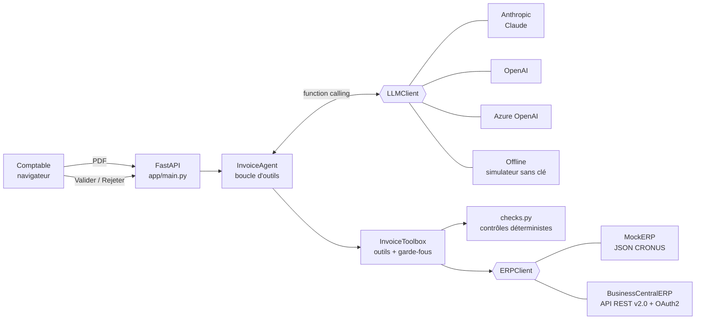

# Agent IA de saisie de factures fournisseurs — Dynamics 365 Business Central

🇬🇧 [English version](README.en.md)

Démo d'un **agent IA** qui lit une facture fournisseur PDF, la contrôle contre l'ERP et crée une **facture d'achat en brouillon** dans Microsoft Dynamics 365 Business Central. Un comptable valide ou rejette en un clic : **rien n'est comptabilisé sans validation humaine**.

> **5 min de saisie → 30 s de validation.**

---

## 1. Le problème métier

Dans une PME/ETI, la saisie des factures fournisseurs reste largement manuelle :

| Étape manuelle | Temps typique |
|---|---|
| Ouvrir le PDF, retrouver le fournisseur dans l'ERP | ~1 min |
| Retrouver le bon de commande, comparer lignes et prix | ~1 à 2 min |
| Vérifier que la facture n'a pas déjà été saisie | ~30 s |
| Saisir l'en-tête et les lignes de la facture d'achat | ~1 à 2 min |
| **Total** | **≈ 5 min / facture** |

C'est une tâche répétitive et sujette aux erreurs (fautes de frappe, doublons payés deux fois, hausses de prix non détectées). L'agent la prend en charge et ne laisse au comptable que la décision : **≈ 30 s de relecture**.

**Gain estimé** pour 1 000 factures/mois : 1 000 × 4,5 min ≈ **75 h/mois**, soit environ un mi-temps, sans compter les erreurs évitées (doublons, écarts de prix). *Ordre de grandeur, à mesurer sur le volume réel du client.*

## 2. Ce que fait l'agent

1. **Dépôt** d'une facture PDF dans l'interface web.
2. **Extraction par LLM** : fournisseur, n° de TVA, n° de facture, date, échéance, référence de commande, lignes (désignation, quantité, PU), HT, TVA, TTC.
3. **Outils ERP (function calling)** que l'agent appelle lui-même :
   - `search_vendor` : recherche du fournisseur (n° de TVA puis nom approché)
   - `check_duplicate_invoice` : contrôle des doublons de n° de facture
   - `find_purchase_order` / `compare_with_purchase_order` : rapprochement avec le bon de commande
   - `create_draft_purchase_invoice` : création de la facture d'achat **en brouillon**
4. **Détection d'anomalies** : écart de montant avec la commande, écart de prix ou de quantité, doublon, fournisseur inconnu ou bloqué, total incohérent (lignes ≠ HT, HT + TVA ≠ TTC), taux de TVA inhabituel.
5. **Interface** : données extraites, **raisonnement pas à pas** (chaque appel d'outil avec ses arguments et sa réponse), anomalies, aperçu du PDF, boutons **Valider** (comptabilisation) / **Rejeter** (suppression du brouillon).

### Principes de conception (garde-fous)

- **Le LLM orchestre, le code contrôle.** Tous les contrôles (arithmétique, doublons, écarts avec la commande) sont calculés par du code déterministe dans les outils. Le modèle ne peut donc ni inventer une anomalie ni en masquer une.
- **Garde-fous côté serveur, pas seulement dans le prompt.** `create_draft_purchase_invoice` refuse de créer un brouillon si les données n'ont pas été enregistrées, si le fournisseur est inconnu ou bloqué, si le contrôle de doublon n'a pas été fait ou s'il a trouvé un doublon.
- **Recommandation plafonnée.** Si des anomalies bloquantes existent, une recommandation « valider » du LLM est automatiquement rétrogradée en « à vérifier ».
- **L'humain décide.** L'agent ne comptabilise jamais. Seul le bouton *Valider* appelle l'action `post` de Business Central.

## 3. Architecture



```
Facture PDF ─► extraction texte (pypdf) ─► LLM ──┐
                       (PDF natif pour Claude)   │ appels d'outils
                                                 ▼
          ┌──────────────── InvoiceToolbox ────────────────┐
          │ record_invoice_data  → contrôle arithmétique   │
          │ search_vendor        → ERP : vendors           │
          │ check_duplicate      → ERP : purchaseInvoices  │
          │ find_purchase_order  → ERP : purchaseOrders    │
          │ compare_with_po      → rapprochement lignes    │
          │ create_draft         → ERP : POST brouillon    │
          │ submit_final_report  → synthèse, recommandation│
          └────────────────────────────────────────────────┘
                                                 ▼
                 UI : données · anomalies · raisonnement · [Valider] [Rejeter]
```

### Arborescence

```
app/
  main.py                 API FastAPI (upload, suivi, validation, rejet)
  config.py               configuration via .env
  models.py               modèles Pydantic (facture, ERP, trace de l'agent)
  pdf_utils.py            lecture PDF
  agent/
    invoice_agent.py      orchestrateur + prompt système
    tools.py              schémas des outils + exécution + garde-fous
    checks.py             contrôles métier déterministes
  llm/
    base.py               interface LLMClient (indépendante du fournisseur)
    anthropic_client.py   Claude (Messages API, tool use, PDF natif)
    openai_client.py      OpenAI et Azure OpenAI (Chat Completions, tools)
    offline_client.py     simulateur déterministe (démo sans clé)
  erp/
    base.py               interface ERPClient + rapprochement approché des noms
    mock_erp.py           ERP local (données CRONUS)
    business_central.py   API REST Business Central v2.0
  static/                 interface web (HTML/CSS/JS, sans build)
data/seed/                fournisseurs, commandes, factures CRONUS
samples/                  factures PDF de test
scripts/generate_invoices.py
tests/                    tests de bout en bout
```

## 4. Lancement

Prérequis : Python 3.11 ou plus récent.

```bash
pip install -r requirements.txt
cp .env.example .env               # sous Windows : copy .env.example .env
python scripts/generate_invoices.py   # (re)génère les PDF de test dans samples/
uvicorn app.main:app --reload
```

Ouvrir http://127.0.0.1:8000, puis cliquer sur une facture de démonstration ou déposer un PDF.

### Choisir le LLM (`LLM_PROVIDER`)

| Valeur | Usage | Variables |
|---|---|---|
| `offline` *(défaut)* | Démo **sans clé ni réseau** : extraction par règles et séquence d'outils scriptée. Les outils, les contrôles, l'ERP et l'interface sont les mêmes qu'avec un vrai LLM. | — |
| `anthropic` | Claude, qui lit **le PDF natif** (fonctionne aussi sur les scans) | `ANTHROPIC_API_KEY`, `ANTHROPIC_MODEL` (défaut `claude-opus-5-5`), `ANTHROPIC_EFFORT` |
| `openai` | OpenAI, qui reçoit le texte extrait du PDF | `OPENAI_API_KEY`, `OPENAI_MODEL` |
| `azure_openai` | Azure OpenAI (données hébergées dans le tenant Azure du client) | `AZURE_OPENAI_ENDPOINT`, `AZURE_OPENAI_API_KEY`, `AZURE_OPENAI_API_VERSION`, `AZURE_OPENAI_DEPLOYMENT` |

### Choisir l'ERP (`ERP_MODE`)

- `mock` *(défaut)* : données JSON inspirées de la société de démo **CRONUS** (fournisseurs 10000 à 50000, commandes 106001 à 106005). Les écritures vont dans `data/runtime/`. Le lien **« Réinitialiser la démo »** restaure l'état initial.
- `business_central` : appels réels à l'API REST v2.0.

### Factures de test

| Fichier | Scénario | Résultat attendu |
|---|---|---|
| `01_facture_conforme_fabrikam.pdf` | Conforme à la commande 106001 | Brouillon créé, recommandation **valider** |
| `02_facture_ecart_montant_wwi.pdf` | PU +12 % par rapport à la commande 106002 | Brouillon créé, `AMOUNT_MISMATCH_PO` et `PRICE_MISMATCH_PO`, **à vérifier** |
| `03_facture_doublon_first_up.pdf` | N° déjà saisi et payé | **Aucun brouillon**, `DUPLICATE_INVOICE`, **rejeter** |
| `04_facture_fournisseur_inconnu.pdf` | Fournisseur absent de l'ERP | **Aucun brouillon**, `UNKNOWN_VENDOR`, **rejeter** |
| `05_facture_total_incoherent_gdi.pdf` | TTC imprimé ≠ HT + TVA | Brouillon créé, `TOTAL_INCONSISTENT`, **à vérifier** |

💡 Pour la démo : validez la facture 01, puis soumettez-la à nouveau. L'agent la détecte alors comme doublon.

### Tests

```bash
python -m pytest -q
```

Les tests couvrent les 5 scénarios de bout en bout (offline + Mock), le connecteur Business Central face à une API simulée (OAuth2, OData, création, comptabilisation, rollback) et les boucles d'outils Anthropic et OpenAI face à des réponses simulées.

## 5. Brancher un vrai Business Central

1. **Entra ID** : créer une *App registration*, puis un secret client. Ajouter la permission **applicative** *Dynamics 365 Business Central → `API.ReadWrite.All`* et accorder le consentement administrateur.
2. **Business Central** : ouvrir la page *Applications Microsoft Entra*, ajouter le *Client ID*, l'activer et lui attribuer des ensembles d'autorisations couvrant les achats (par ex. `D365 BUS FULL ACCESS` pour une sandbox).
3. Renseigner le `.env` :
   ```ini
   ERP_MODE=business_central
   BC_TENANT_ID=<tenant GUID>
   BC_CLIENT_ID=<app id>
   BC_CLIENT_SECRET=<secret>
   BC_ENVIRONMENT=Sandbox
   BC_COMPANY_NAME=CRONUS France S.A.
   BC_DEFAULT_GL_ACCOUNT=607000
   ```

Endpoints utilisés (`https://api.businesscentral.dynamics.com/v2.0/{tenant}/{env}/api/v2.0/companies({id})/…`) :

| Besoin | Appel |
|---|---|
| Fournisseur | `GET vendors?$filter=taxRegistrationNumber eq '…'`, puis rapprochement approché sur `displayName` |
| Commande | `GET purchaseOrders?$filter=…&$expand=purchaseOrderLines` |
| Doublon | `GET purchaseInvoices?$filter=vendorNumber eq '…' and vendorInvoiceNumber eq '…'` |
| Brouillon | `POST purchaseInvoices`, puis `POST purchaseInvoices({id})/purchaseInvoiceLines` (rollback si une ligne échoue) |
| Valider | `POST purchaseInvoices({id})/Microsoft.NAV.post` |
| Rejeter | `DELETE purchaseInvoices({id})` |

Le connecteur gère le cache du jeton OAuth2, la pagination `@odata.nextLink`, les relances sur 429/5xx (`Retry-After`), le renouvellement du jeton sur 401 et l'échappement des chaînes OData.

## 6. Limites et pistes

**Limites actuelles de la démo**
- Les lignes du brouillon ne sont pas liées aux réceptions de la commande (*Extraire lignes réception*). Le rapprochement est fait par l'agent, pas par le lettrage natif de BC. Une extension AL pourrait exposer cette action.
- Le texte est extrait avec pypdf pour OpenAI et le mode offline. Les PDF scannés demandent Claude (lecture native du PDF) ou une étape d'OCR (par ex. Azure AI Document Intelligence).
- Le mode `offline` est calibré sur la mise en page des factures de test. Ce n'est pas un extracteur générique.
- Les traitements sont stockés en mémoire, sans authentification ni multi-utilisateur. Une base de données, Entra ID SSO et une piste d'audit seraient nécessaires en production.
- Une seule TVA par facture, une devise (EUR), une facture par PDF.
- Coût LLM : avec Claude Opus 5.5, prévoir de l'ordre de quelques dizaines de centimes par facture (≈ 8 allers-retours). À mesurer. Leviers : prompt caching, `ANTHROPIC_EFFORT=low`, ou un modèle plus léger pour les factures simples.

**Pistes d'industrialisation dans l'écosystème Microsoft**
- **Power Automate** : déclencher l'agent à la réception d'un e-mail dans la boîte *factures@* (connecteur Outlook) ou au dépôt d'un fichier dans SharePoint, puis notifier le comptable dans **Teams** avec une *carte adaptative* Valider/Rejeter qui appelle `/validate` ou `/reject`.
- **Copilot Studio** : exposer l'agent comme agent Copilot (« Quelles factures attendent ma validation ? », « Pourquoi la facture WWI est-elle bloquée ? »), avec les outils de ce projet déclarés comme actions et le connecteur Business Central natif.
- **Business Central** : extension AL avec une page « Factures à valider » et une action *Envoyer à l'agent*, ou un flux d'approbation natif à la place du bouton Valider.
- **Azure** : déploiement sur Azure Container Apps, Azure OpenAI dans le tenant du client, Key Vault pour les secrets, Application Insights pour suivre le taux d'automatisation et les anomalies.
- **Apprentissage** : mémoriser les corrections du comptable (correspondance article et désignation fournisseur, tolérances par fournisseur).
